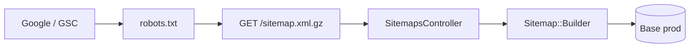

## Sitemap production FR/EN (dynamique)

Le sitemap est servi par Rails a l'URL publique **`https://a1soir.com/sitemap.xml.gz`**, comme le feed Merchant. Il est **genere a la demande** depuis la base de donnees du dyno (prod = catalogue prod). Il n'est **plus** un fichier statique a committer dans `public/`.

Google le decouvre via [`public/robots.txt`](public/robots.txt) :

```txt
Sitemap: https://a1soir.com/sitemap.xml.gz
```

Canal distinct du feed Google Merchant Center (Shopping) : `/google_merchant_feed.xml`.

### Architecture



| Composant | Role |
|-----------|------|
| [`Sitemap::Builder`](app/services/sitemap/builder.rb) | Logique unique : pages statiques, categories, produits (meme perimetre qu'avant) |
| [`SitemapsController`](app/controllers/sitemaps_controller.rb) | Reponse gzip + en-tetes cache HTTP |
| [`config/sitemap.rb`](config/sitemap.rb) | Optionnel : ecriture locale pour debug via `rake sitemap:refresh` |
| ~~`public/sitemap.xml.gz`~~ | **Supprime du repo** — sinon Rack sert le statique avant la route |

### Contenu (perimetre URLs)

| Type | Exemple | Scope |
|------|---------|--------|
| Pages statiques | `/fr/home`, `/en/contact` | Liste fixe |
| Categories | `/fr/produits/robes-12` | `CategorieProduit.not_service` |
| Fiches produit | `/fr/produit/robe-123` | `Produit.actif` + `eshop: true` + `today_availability: true` |

Chaque URL catalogue en **fr** et **en**. Host canonique : `ENV['SITEMAP_HOST']` ou `https://a1soir.com` en production.

**Mise a jour automatique :** quand le stock ou `today_availability` change en base, le prochain crawl du sitemap reflete l'etat courant (pas de regen manuelle / commit).

**Pas de cache Redis** : en-tete `Cache-Control: public, max-age=604800` (1 semaine) pour limiter la charge ; le contenu catalogue en base evolue toujours, mais la regen HTTP est au plus hebdomadaire par client/proxy.

---

### Deploiement

1. Deployer le code (route + service + suppression du `.gz` statique).
2. Verifier en prod :

```bash
curl -sI https://a1soir.com/sitemap.xml.gz | grep -E 'HTTP|content-type|content-length|cache-control'
curl -sL https://a1soir.com/sitemap.xml.gz | gunzip | grep -c '<loc>'
curl -sL https://a1soir.com/sitemap.xml.gz | gunzip | grep 'fr/produit/' | head -3
```

Attendu apres deploy : **content-length ~45 Ko**, **~5500** `<loc>`, URLs `fr/produit/` et `fr/produits/`.

Si `content-length: 523` et **1** `<loc>` : l'ancien fichier statique est encore dans le slug → verifier que `public/sitemap.xml.gz` n'est plus dans le repo deploye.

3. **Google Search Console** → Indexation → Sitemaps : URL `https://a1soir.com/sitemap.xml.gz` (resoumettre une fois apres bascule).

Le ping Google en fin de `rake sitemap:refresh` (`Sitemaps ping is deprecated`) est **sans effet** ; ne pas s'en servir.

---

### Debug local (optionnel)

Pour inspecter le XML sans passer par HTTP :

```bash
cd ~/ror/a1soir
SITEMAP_HOST=https://a1soir.com bundle exec rake sitemap:refresh
# ecrit public/sitemap.xml.gz (gitignore) — utilise la base locale sauf DATABASE_URL prod
```

Pour tester avec la **base prod** en local (one-shot) :

```bash
export DATABASE_URL="$(heroku config:get DATABASE_URL -a a1soir-2)"
SITEMAP_HOST=https://a1soir.com RAILS_ENV=production bundle exec rake sitemap:refresh
unset DATABASE_URL
```

En dev, le sitemap HTTP est aussi disponible : `http://localhost:3000/sitemap.xml.gz`.

---

### Ancien workflow (obsolete)

~~Generer en local, committer `public/sitemap.xml.gz`, deployer.~~  
~~`heroku run rake sitemap:refresh` + copie base64.~~

Remplaces par le sitemap dynamique (filesystem Heroku ephemere + risque de fichier statique obsolete en prod).

---

## Google Merchant Center (feed produits)

En production (Heroku), le feed **n'est pas** un fichier statique dans `public/` : l'URL publique reste :

`https://a1soir.com/google_merchant_feed.xml`

Rails sert ce chemin via `GoogleMerchantFeedsController` : XML **genere a la demande** (`GoogleMerchant::StaticFeed.to_xml`).

Perimetre du feed (plus strict que le sitemap) : `actif`, `eshop`, image, `prixvente > 0`, etc. Voir `GoogleMerchant::FeedBuilder`.

### Planification des mises a jour

Configurer la date/heure de recuperation dans Google Merchant Center. Pas de job Heroku obligatoire pour le feed.

### Verification

- Ouvrir l'URL du feed (`curl -sI` ou navigateur).
- Surveiller les erreurs de fetch dans Merchant Center au prochain creneau.
